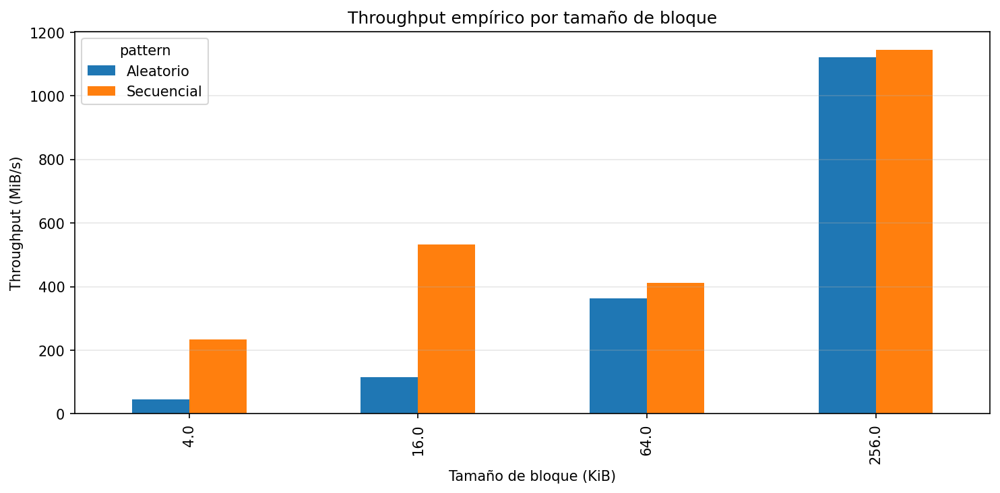
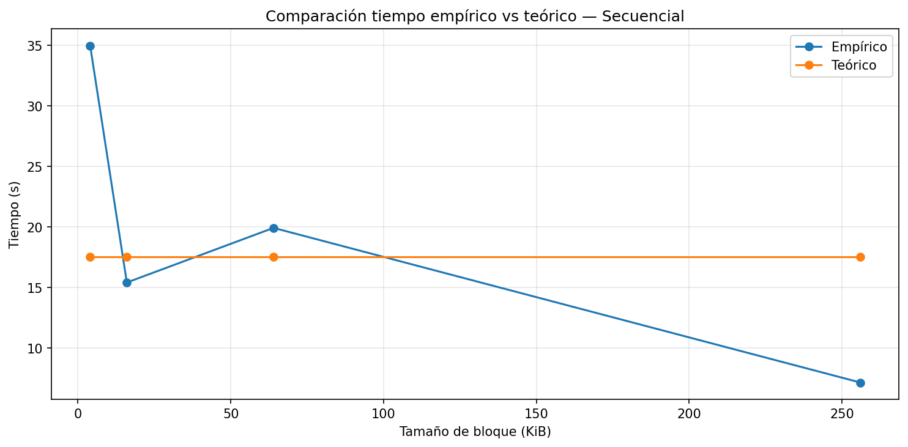
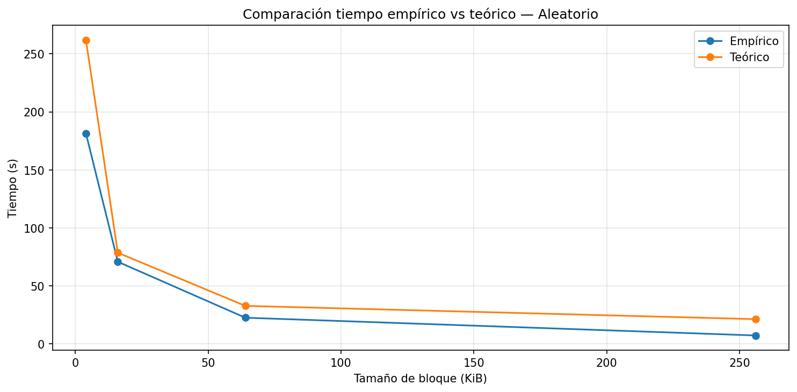
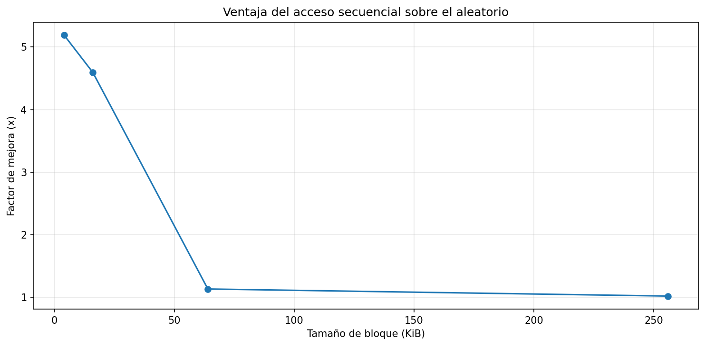

# Laboratorio 3: Acceso a Disco y Costo de E/S (I/O)
**Autor:** Mateo Upegui  
**Curso:** Diseño de Bases de Datos (UdeA)

## Etapa 1: Caracterización del Equipo

| Parámetro                        | Valor de Referencia |
| :------------------------------- | :------------------ |
| **Sistema Operativo**            | macOS 26.3.1        |
| **Modelo de CPU**                | Apple M1 Max        |
| **Núcleos de CPU**               | 10 Cores            |
| **RAM Total**                    | 32 GB               |
| **Tecnología de Almacenamiento** | Apple NVMe SSD      |

## Etapa 2: Resultados Experimentales

Las siguientes gráficas fueron generadas mediante la ejecución del notebook `disk_io_lab_guided.ipynb`.

### 1. Comparación de Throughput

### 2. Secuencial: Teoría vs. Práctica

### 3. Aleatorio: Teoría vs. Práctica

### 4. Speedup (Ventaja Secuencial)

## Etapa 3: Análisis e Interpretación

### Preguntas de Análisis Científico

**1. Diferenciales de rendimiento (Secuencial vs. Aleatorio):**
El mayor diferencial se observó con bloques de **4 KB**: acceso secuencial de **234 MiB/s** frente a acceso aleatorio de **45.15 MiB/s**, equivalente a un factor de aproximadamente **5.2x** a favor del patrón secuencial. Este resultado es consistente con el modelo de costo I/O, donde el acceso aleatorio incrementa el número de accesos no contiguos y por tanto acumula más latencia.

**2. El efecto del tamaño de bloque en los costos de acceso aleatorio:**
El throughput aleatorio aumentó de forma marcada al incrementar el tamaño de bloque: de **45.15 MiB/s** en 4 KB hasta **1121.03 MiB/s** en 256 KB. Esto ocurre porque cada acceso aleatorio transfiere más datos, amortizando el costo fijo de latencia por operación.

**3. Correlaciones y desviaciones del modelo teórico:**
Para ajustar teoría y práctica se calibró el modelo con corridas repetidas y mínimos cuadrados, usando:

- $T = \alpha M + \beta \cdot DataSize$
- $M = 1$ para secuencial
- $M = num\_reads$ para aleatorio

El ajuste resultó en **$\alpha = 116.49\,\mu s$** y **$\beta = 2.040803164196\times10^{-9}\,s/B$** (throughput implícito ~**0.46 GB/s**). Aunque la calibración mejora la escala global, persisten desviaciones porque el modelo simplifica efectos reales como paralelismo interno del SSD, cachés internas y variabilidad del sistema.

**4. ¿Por qué el acceso aleatorio sigue siendo costoso en los SSD?**
Aun en SSD, el acceso aleatorio sigue siendo costoso porque cada operación implica una latencia de control/cola y menor localidad espacial. Con bloques pequeños, esa latencia domina el tiempo total; por eso se observó una diferencia de **5.2x** entre secuencial y aleatorio en 4 KB.

**5. Implicaciones para el diseño de motores de bases de datos:**
Los resultados sugieren diseñar motores y planes de consulta que favorezcan acceso secuencial, lecturas por lotes y alta localidad de datos. En cargas intensivas de I/O, minimizar lecturas aleatorias pequeñas puede producir mejoras grandes de rendimiento y estabilidad.
